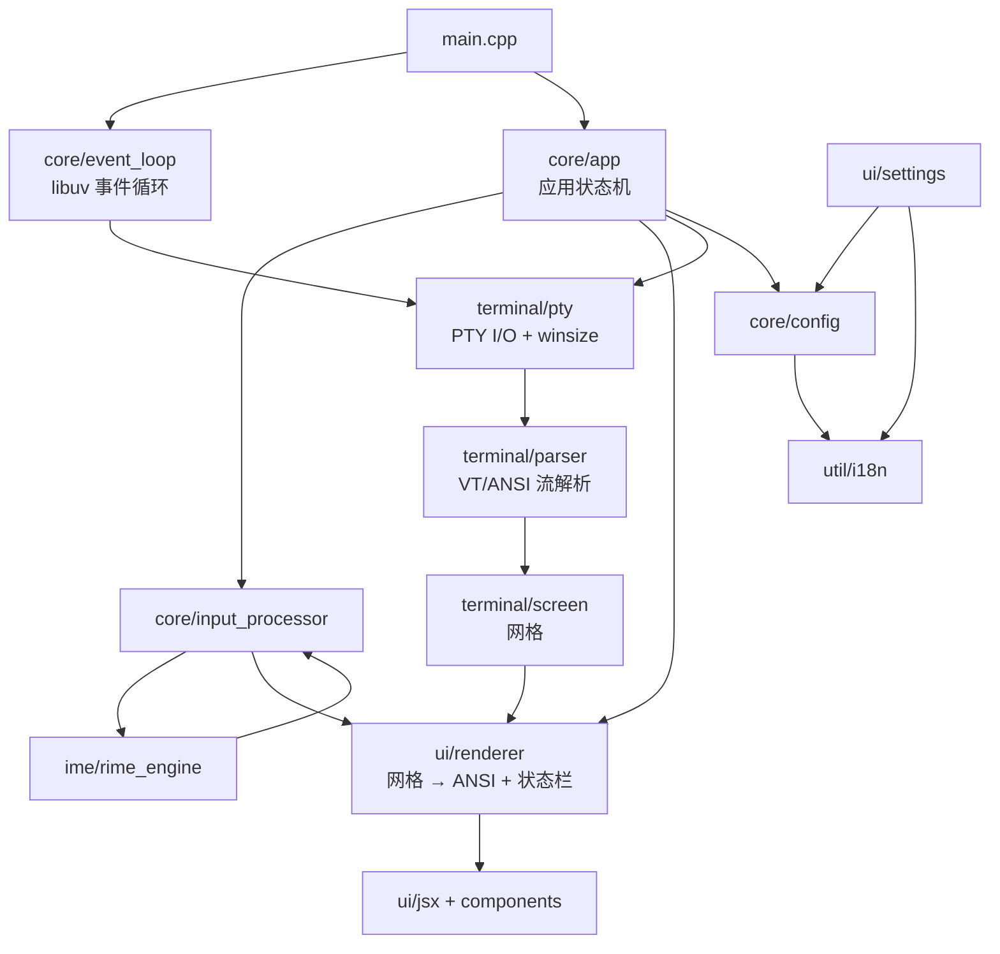

# System architecture

## Overview

终端内嵌输入法：一个自绘终端模拟器（PTY + 网格渲染），叠加 Rime 输入引擎做组字/候选。
纯 C++17，无 GUI 框架；UI 用项目自带的 JSX-like 组件层直接渲染 ANSI。

| 层 | 路径 | 职责 |
|---|---|---|
| core | `src/core/` | 事件循环（libuv）、应用状态机、输入处理、配置、尺寸协调 |
| terminal | `src/terminal/` | PTY 读写、ANSI/VT 解析器、屏幕网格 |
| ui | `src/ui/` | Renderer（网格 → ANSI）、组件/JSX 层、设置面板 |
| ime | `src/ime/` | 输入引擎抽象、Rime 实现、语言列表 |
| util | `src/util/` | UTF-8、i18n、日志 |

## Module graph

## Constraints

Hard constraints that shape the architecture:

- **libuv 句柄所有权**：`uv_close` 时所有权 release 给 libuv，由 close 回调 `delete`；`EventLoop` 析构必须先 `uv_run` 排空 close 回调再 `uv_loop_close`，否则 use-after-free / `UV_EBUSY`。见 [[event-loop-libuv-handle-ownership]]。
- **状态栏占用终端最后一行**：shell 可用区 = `rows - 1`，`Pty` 与 `Screen` 都按 `rows - 1`；任何 resize 之后必须清 `Renderer::last_bar_sig_`。见 [[status-bar-owns-last-row]]。
- **Parser 是任意切分的字节流消费者**：未完成 UTF-8 序列必须跨 `feed()` 用 `pending_` 保留；私有参数 CSI 与 OSC 字符串体一律不写屏幕网格。见 [[parser-stream-state-contract]]。
- **libuv 回调栈帧里不得有异常逃逸**：`AppConfig::save` 逐字节遵循此约束（永不抛、返回 `bool`）。见 [[config-save-never-throws]]。
- **零外部 GUI 依赖**：渲染只输出 ANSI 转义序列，不引入终端/TUI 框架。
