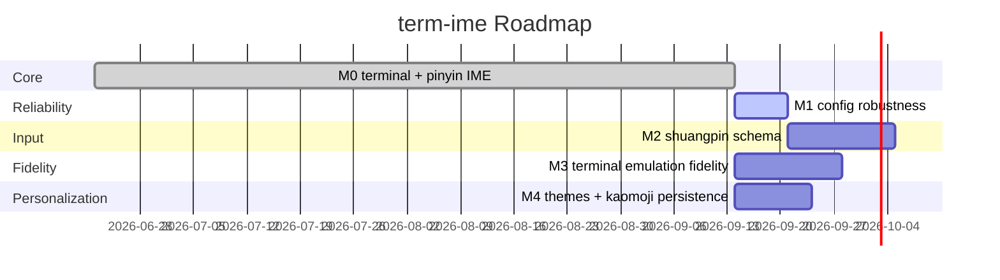

# Roadmap

Milestones are phases, not task lists. Each has one objective, a depends set,
and a done definition you can verify. Captured 2026-09 (replaces the 2026-06
scaffold). Core terminal + pinyin IME already shipped (M0); remaining phases
are real, code-grounded gaps.

## M0 — Core terminal + pinyin IME (done)

Delivered, each backed by a decision page: PTY + VT/ANSI parser + grid renderer
([[parser-stream-state-contract]], [[status-bar-owns-last-row]]); full-pinyin
via librime with simplified-candidate conversion ([[opencc-chain-for-simplified]])
and fuzzy toggle ([[fuzzy-pinyin-toggle]]); adaptive candidate bar
([[candidate-bar-contract]]); settings panel with never-throw save
([[config-save-never-throws]]); cold-start readiness window
([[startup-readiness-window]]); libuv handle ownership
([[event-loop-libuv-handle-ownership]]); fully static single-file binary.

## Phases

| milestone | objective | depends |
|---|---|---|
| M1 config robustness | Reject/clamp out-of-range config on load instead of trusting it; today `max_candidates` (and siblings) flow straight from JSON with no bound check (`src/core/config.cpp`). Define one validation pass + policy. | — |
| M2 shuangpin schema | Add a second input method (双拼) alongside full-pinyin, selectable in settings. Needs a new `data/rime-data/*.schema.yaml` + key-map; only luna_pinyin* exist today. | M1 |
| M3 terminal emulation fidelity | Close remaining VT/ANSI gaps (README: "更多转义序列") — SGR color queries, OSC passthrough — behind the parser stream contract. | — |
| M4 themes + kaomoji persistence | Ship theme switching (README: "主题切换") and make kaomoji load/save from JSON instead of the hardcoded array (`src/ime/kaomoji.cpp:187,197`). | — |

## Done means

- M1: `term-ime.json` with `max_candidates: 20` loads clamped to a legal value;
  a regression test feeds out-of-range keys and asserts the sanitized config.
- M2: 双拼 selectable in the settings panel; typing a 双拼 code yields candidates;
  e2e (`tests/*_e2e.py`) drives it.
- M3: golden parser test reproduces each previously-mishandled sequence; grid
  state matches a reference terminal.
- M4: switching theme re-renders status/candidate bar live (no restart);
  kaomoji edits survive a restart via JSON.

## Sequencing

M0 shipped. M3, M4 are independent of each other and of M1 — parallelizable.
M1 is small and unblocks M2 (schema selection reuses the config-validation
path), so do M1 → M2 as one track. No hard dates; commit per milestone.
